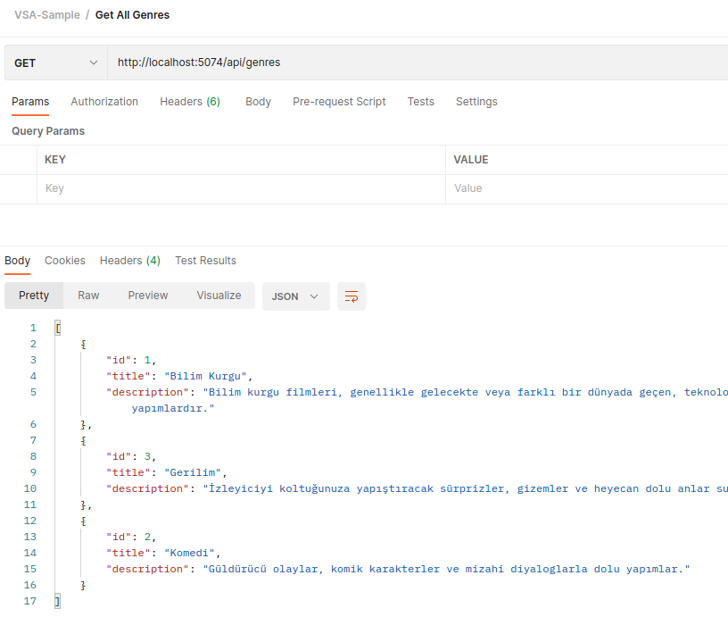

# Uygulamalı Vertical Slice Architecture Deneyi

Bu proje .net tabanlı bir Vertical Slice Architecture uyarlamasıdır. Amacım uygulamalı olarak söz konusu mimarinin nasıl uygulandığını anlamaya çalışmak.

## Sistem ve Kurgu

Çözümü moon isimli Ubuntu 22.04 tabanlı sistemimde yapıyorum. Sistemde .Net 7 sürümü yüklü. Solution MovieApp isimli boş bir web projesi içermekte. VSA ilkeleri gereği ihtiyaçların tamamı buradaki klasörlerde yer alıyor. VSA'nın ana omurgasını oluşturan özellik setleri de Features isimli klasörde yer almakta. Örnekte çok basit bir film arşivi ele alınmakta. Kategori bazlı filmlerin tutulduğu bir çözüm olarak düşünebiliriz.

## Proje Bağımlılıkları

Çözümde nesneler arası map işlemleri için AutoMapper, komut ve sorguların ayrılmasında CQRS deseni ve onu yönetecek olan MediatR ile Postgresql veri tabanı kullanılıyor. Her zaman olduğu gibi postgresql'i docker container olarak kullanmayı tercih edeceğim.

```bash
# postgresql docker container'ını yüklemek için
sudo docker run --name moviesdb -e POSTGRES_USER=scoth -e POSTGRES_PASSWORD=tiger -p 5435:5432 -v /data:/var/lib/postgresql/data -d postgres

# Migration için EF tool'a ihtiyacımız olacaktır
# Eğer sistemde yüklü değil bu komutla yüklenebilir
dotnet tool install -g dotnet-ef

# Migration planı oluşturup çalıştırmak için
dotnet ef migrations add InitialCreate
dotnet ef database update

# Bu işlemden sonra istenirse seed sınıfındaki örnek veriler için program çalıştırılabilir
# Program.cs'teki ilgili kod parçasının açılması yeterlidir ama bu bir zorunluluk değil

# Proje için gerekli nuget paketlerinin yüklenmesi
cd MovieApp

dotnet add package Microsoft.EntityFrameworkCore 
dotnet add package Microsoft.EntityFrameworkCore.Design 
dotnet add package Npgsql.EntityFrameworkCore.PostgreSQL 
dotnet add package AutoMapper 
dotnet add package AutoMapper.Extensions.Microsoft.DependencyInjection 
dotnet add package MediatR 
dotnet add package MediatR.Extensions.Microsoft.DependencyInjection 
dotnet add package Swashbuckle.AspNetCore
```

## Yapılanlar

- Proje iskeleti oluşturulup gerekli bağımlılıklar eklendi.
- Dolaşımdaki varlıklar için model sınıfları oluşturuldu.
- Postgresql odaklı Entity Framework Data Context sınıfı geliştirildi, migration planını takiben bir Seeding operasyonu işletildi.
- Projedeki özellik setleri ile ilintili sözleşmeler(interface tipleri) ve uygulayıcı sınıfları eklendi. (IGenreService, GenreService, IMovieService, MovieService)
- Her feature için ayrıştırılmış servisleri DI container'a register eden ve onlar için unit of work görevi üstlenen yönetici sınıf eklendi. (IFeatureServiceManager, FeatureServiceManager)
- CQRS özelinde sorgu ve komutları ayıracak bir düzene geçildi. Genres ve Movies klasörlerinde Command ve Query isimli klasörler açılıp select ile insert,update,delete gibi aksiyonları ele alan nesneler buralara dağıtıldı.

## Çalışma Zamanı

Örnek proje esasında REST tabanlı bir web api hizmeti. Denemeden önce elbette postgresql tabanlı docker container'ın çalıştığından emin olmak lazım. Sonrasında aşağıdaki komutlardan birisi ile ilerlenebilir.

```bash
dotnet run

# veya kod değişikliklerini de anında görmek için
dotnet watch
```

Çalışma zamanı için örnek sorgular;

```text
İşlem : Tüm film türlerinin listelenmesi
Metot : Http Get
Adres : http://localhost:5074/api/genres
```


```text
İşlem : Belli bir film türüne ait bilgi çekilmesi
Metot : Http Get
Adres : http://localhost:5074/api/genres/2
```


```text
İşlem : Belli türde film eklenmesi
Metot : Http Post
Adres : http://localhost:5074/api/movies
Body  : json
{
    "title": "2001: A Space Odyssey",
    "description": "Stanley Kubrick'in yönettiği ve Arthur C. Clarke'ın aynı adlı romanından uyarlanan bir bilim kurgu filmidir.",
    "totalRevenue": 65.50,
    "year": 1968,
    "month": 4,
    "day": 2,
    "imdbPoint": 8.3,
    "genreId": 1
}
```


```text
İşlem : Belli türe ait filmlerin listesinin çekilmesi
Metot : Http Get
Adres : http://localhost:5074/api/movies/1
```


```text
İşlem : Belli bir ID değerine sahip filmi silmek için
Metot : Http Delete
Adres : http://localhost:5074/api/movies
Body  : json
{
    "movieId": 4
}
```

```text
İşlem : Belli bir film türü için ekstra detay çekmek için
Metot : Http Get
Adres : http://localhost:5074/api/genres/detail/1
```


```text
İşlem : Bir filme ait veri içeriğini güncellemek için
Metot : Http Put
Adres : http://localhost:5074/api/movies
Body  : json
{
    "id": 6,
    "title": "2001:A Space Odyssey",
    "description": "Stanley Kubrick'in yönettiği ve Arthur C. Clarke'ın aynı adlı romanından uyarlanmış olan harika bir bilim kurgu filmidir.",
    "totalRevenue": 165.50,
    "year": 1968,
    "month": 4,
    "day": 2,
    "imdbPoint": 8.5,
    "genreId": 1
}
```


```text
İşlem : Belli bir ID değerine sahip film detayını görmek için
Metot : Http Get
Adres : http://localhost:5074/api/movies/detail/6
```


Swagger dokümantasyonuna erişip aynı operasyonları deneyebiliriz de.


## Senaryo İşletimi

**Yeni bir filmin eklenmesini değerlendirelim.** Süreç istemci tarafında bir HTTP Post çağrısı yapmasıyla başlar. Çağrıyı Features/Movies klasöründeki MoviesController sınıfındaki AddMovie fonksiyonu karşılar. Fonksiyon parametresi AddMovieToGenre.AddMovieCommand türündendir. JSON içeriği bu sınıf örneğine serileşir. AddMovie fonksiyonu gelen komutu Meidator'a yönlendirir. Mediatr gelen Command'in hangi Handler sınıfı ile ilişkili olduğunu bilir. Bakınız - Movies/Command klasöründeki public class Handler : IRequestHandler<AddMovieCommand, MovieResult> sınıfı. Mediatr bu komuta ilişkin handler nesnesini bulduktan sonra Handle metodunu işletir. Handle metodu implemente edilen arayüze göre şekillenmiştir ve Controller'dan inen komut nesne örneğini parametre olarak kullanabilir. Handle fonksiyonu içerisinde, Handler sınfına enjekte edilen IFeatureService örneği üstünden gerekli çağrılar yapılır. FeatureService örneğinin Movie özelliğinden erişilen MovieService sınıfının ilgili fonksiyonları çağırılır. Tür bilgisi olup olmadığı kontrol edilir, şartlar uygunsa film bilgisi işlenmek üzere ilgili AddMovieToGenre fonksiyonuna gönderilir. MovieService içerisinde bu fonksiyon sınıfa enjekte edilen DataContext nesnesini kullanır ve ilgili verinin EF üstünden veri tabanına yazılması sağlanır. Handle içerisinde son kısımda eklenen film bilgisine karşılık gelen ve komuttan controller'a, oradan da HTTP çağrısına dönecek olan MovieResult için bir mapping işlevi uygulanır.